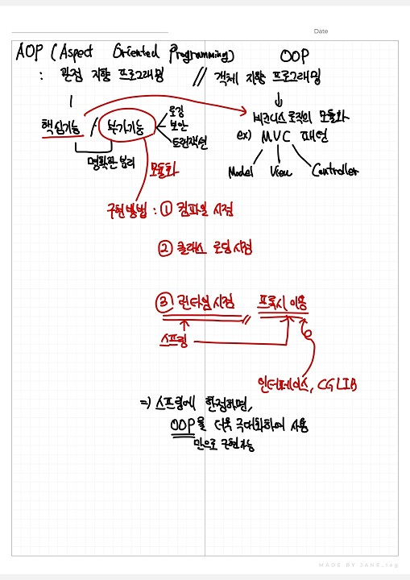
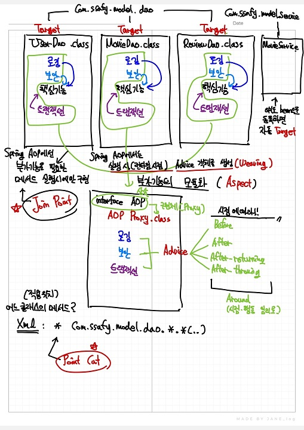
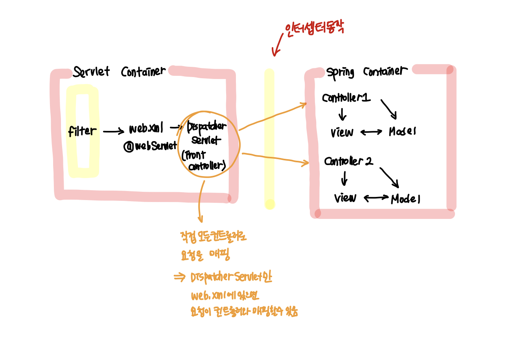
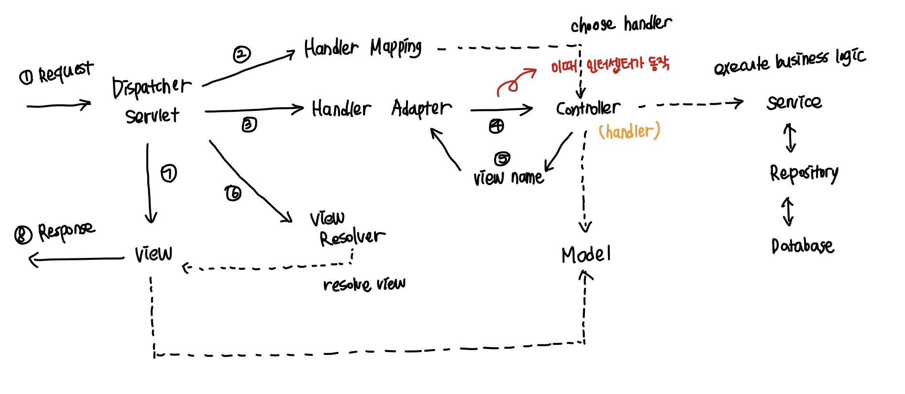
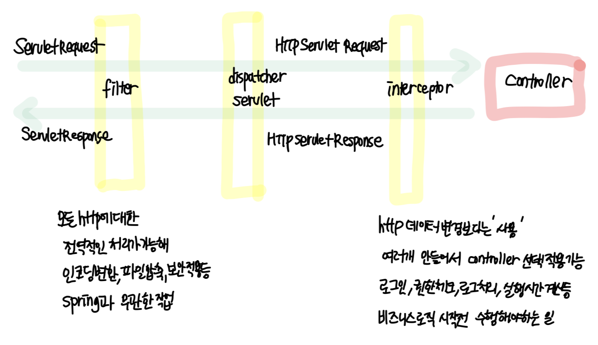

# 💡SPRING DI

## DI(Dependency Injection) 의존성 주입

A 객체가 어떤 일을 처리하기 위해서 B 객체의 도움을 받아야 한다면 A가 B에 의존한다.

### 🔍 의존관계 역전

- 객체 생성 의존성 제거
- 타입 의존성 제거

의존관계 역전이란, 객체에 존재하는 의존관계들을 제거하고, 그 의존관계를 객체 외부로 넘기는 것을 말한다.

### 🔍 의존성 주입

```java
public class Person {

    private Food food;

    // 1. 생성자에 food를 주입한다
    public  Person(Food food){
        this.food = food;
    }

    //2. 설정자에 food를 주입한다.
    public setFood(Food food){
        this.food = food;
    }

    public void eat(){
        System.out.println(food.name() + "을 먹는다");
    }
}
```

### 🔍 Spring IoC Container(Spring Inversion of Control Container)

- Bean : 스프링에서 핵심적인 역할을 하는 객체
- Container : Bean의 인스턴스화 조립, 관리, 사용 소멸에 대한 처리 담당

### 🔍 스프링 설정 정보

설정 정보를 작성하는 방법은 총 3가지

```
(1) XML방식
(2) Annotation방식
(3) Java 방식
```

### 🔍 bean 직접 등록 예시

#### (1) 빈등록

```xml
<bean class="com.ssafy.test.Person" id = "person"/>
```

#### (2) 생성자 주입

```xml
<bean class="com.ssafy.test.Chicken" id = "chicken"/>
<bean class="com.ssafy.test.Person" id = "person">
    <constructor-arg ref="chicken"/>
</bean>
```

#### (3) 설정자 주입

**name** : setter와 매핑(setFood -> food)

**ref** : 참조할 Bean의 id

```xml
<bean class="com.ssafy.test.Pizza" id = "pizza"/>
<bean class="com.ssafy.test.Person" id = "person">
    <property name="food" ref="pizza"/>
</bean>
```

### 🔍 Annotation으로 의존성 주입

```java
interface Food {
	String getName();
}

@Component
class Chicken implements Food{
	public String getName() {
		return "치킨";
	}
}
@Component
class Pizza implements Food{
	public String getName() {
		return "피자";
	}

}

class Person{

    //1. 필드주입
    @Autowired
    @Qaulifier("beanName")
    private Food food;

    //2. 생성자 주입
    @Autowired
    public Person(@Qualifier("beanName")Food food){
    	this.food = food;
    }

    //3. 설정자 주입
    @Autowired
    public void setFood(@Qaulifier("beanName")Food food) {
    	this.food = food;
    }

    public void eat(){
        System.out.println(food.getName() + "을(를) 먹습니다");
    }
}

```

### 🔍 Bean Scope

`Bean 범위를 정의해서 객체의 범위를 제어할 수 있다.`

(1) singleton : 기본값. 단일 객체 인스턴스

(2) prototype : 빈을 요청할 때 마다 새로운 인스턴스 생성

(3) request : HTTP Request 주기로 bean 인스턴스 생성

(4) session : HTTP Session 주기로 bean 인스턴스 생성

# SPRING AOP


 \

## Spring AOP 적용방식 - xml

- xml방식과 annotation 방식 모두 spring에 내장돼있는 AspectJ 라이브러리를 활용한다.

- Spring AOP는 인터페이스 또는 CGLIB 프록시를 통해 구현체를 만들어 구현하므로, 만든 구현체를 bean으로 등록하는 과정이 필요하다.

- resources, application

- bean으로 등록한 후, 어떤 pointcut에 대하여 AOP를 설정할지 결정하고, 등록한 bean에서 어느 advice 타입에 어느 메서드를 사용할지를 등록해주면 된다.

```xml
	<aop:config>
		<aop:pointcut expression="execution(public * com.ssafy.aop.coding())" id="mypt"/>
		<aop:aspect ref="myAspect">
			<aop:before method="before" pointcut-ref="mypt"/>
			<aop:after-returning method="afterReturning" pointcut-ref="mypt"/>
			<aop:after-throwing method="afterThrowing" pointcut-ref="mypt" throwing="th"/>
			<aop:after method="after" pointcut-ref="mypt"/>
      <!-- 둘다있어도 작동엔 문제가 없다. -->
			<!-- <aop:around method="around" pointcut-ref="mypt"/> -->
		</aop:aspect>
	</aop:config>


```

## Spring AOP 적용방식 - annotation

- 굳이 bean으로 등록하지 않고, AOP 구현체에 @Asepect를 붙이고, 각 메서드에 advice type을 annotation으로 적어주면 된다.
```java
package com.ssafy.aop;
//before, after, after-returning, after-throwing를 이용할 경우

import org.aspectj.lang.ProceedingJoinPoint;
import org.aspectj.lang.annotation.After;
import org.aspectj.lang.annotation.AfterReturning;
import org.aspectj.lang.annotation.AfterThrowing;
import org.aspectj.lang.annotation.Aspect;
import org.aspectj.lang.annotation.Before;
import org.aspectj.lang.annotation.Pointcut;
import org.springframework.stereotype.Component;

@Component
@Aspect
//공통관심사항들을 작성할 클래스를 생성한다.
public class MyAspect2 {
	
	//모든 반환 타입의 해당 패키지의 모든 클래스의 coding이라는 메서드가 등장할 때
	@Pointcut("execution(public * com.ssafy.aop.*.coding())")
	public void mypt() {
		
	}
	
	
	
	//실행 이전
	//제대로 붙었다면 화살표가 붙어야되는데
	@Before("mypt()")
	public void before() {
		System.out.println("컴퓨터를 부팅한다.");
	}
	
	//실행 이후 (예외 없이)
	@AfterReturning("mypt()")
	public void afterReturning() {
		System.out.println("Git에 Push 한다.");
	}
	
	//예외 발생
	@AfterThrowing(value = "mypt()", throwing = "th")
	public void afterThrowing(Throwable th) {
		System.out.println("반차를 낸다.");
		if(th instanceof OuchException) {
			((OuchException)th).handleException();
		}
	}
	
	@After("mypt()")
	public void after() {
		System.out.println("하루를 마무리 한다.");
	}

}


```


```java
//around를 이용할 경우
package com.ssafy.aop;

import org.aspectj.lang.ProceedingJoinPoint;
import org.aspectj.lang.annotation.Around;
import org.aspectj.lang.annotation.Aspect;
import org.aspectj.lang.annotation.Pointcut;
import org.springframework.stereotype.Component;

@Component
@Aspect
//공통관심사항들을 작성할 클래스를 생성한다.
public class MyAspect {
	
	//모든 반환 타입의 해당 패키지의 모든 클래스의 coding이라는 메서드가 등장할 때
	@Pointcut("execution(public * com.ssafy.aop.*.coding())")
	public void mypt() {
		
	}
	
	
	
	//실행 이전
	public void before() {
		System.out.println("컴퓨터를 부팅한다.");
	}
	
	//실행 이후 (예외 없이)
	public void afterReturning() {
		System.out.println("Git에 Push 한다.");
	}
	
	//예외 발생
	public void afterThrowing(Throwable th) {
		System.out.println("반차를 낸다.");
		if(th instanceof OuchException) {
			((OuchException)th).handleException();
		}
	}
	
	public void after() {
		System.out.println("하루를 마무리 한다.");
	}
	
	//////////////////////////////////////////// 이걸로 위의 것들을 모두 대체가능
	
	@Around("mypt()")
	public void around(ProceedingJoinPoint pjt) {
		this.before();
		
		try {
			pjt.proceed();
			this.afterReturning();
		}catch (Throwable e) {
			this.afterThrowing(e);
		}finally {
			this.after();
		}
		
	
	}
	
}

```


# SPRING MVC
- Servlet API를 기반으로 구축된 웹 프레임워크

## Model

- 동작을 수행하는 코드

- 사용자 View에 어떻게 보일지에 대해서 신경 x

- 데이터 질의에 대한 정보를 제공하는 기능 및 데이터에 대한 수정을 담당

## View

- 사용자가 화면에 무엇을 어떻게 볼 것인지를 결정

- 사용자 화면에 보이는 부분
- 모델의 정보를 받아와 사용자에게 보여주는 역할 수행
- 자체적으로 모델의 정보를 보관 x

## Controller

- 모델과 뷰를 연결하는 역할을 수행

- 사용자에게 데이터를 가져오고 수정하고 제공

## Servlet Container 구성

1. Servlet WebApplicationContext

    - Controllers, ViewResolver, HandlerMapping (Web과 관련된 것들)
2. Root WebApplicationContext
    - Services, Repositories ... (그 외의 것들)

## Spring MVC 구성요소

- DispatcherServlet - 클라이언트 요청처리 (요청 및 처리 결과 전달)

- HandlerMapping - 요청을 어떤 Controller가 처리할 지 결정 
    - BoardController or UserController 등등 어떤 컨트롤러를 사용할지
- Controller - 요청에 따라 수행할 메서드를 선언, 요청처리를 위한 로직 수행 (비즈니스 로직 호출 - Service 호출)
- ModelAndView - 요청처리를 하기 위해서 필요한 혹은 그 결과를 저장하기 위한 객체
- ViewResolver - Contorller에 선언된 view이름을 기반으로 어떤 View(jsp)를 결정
- View - 응답화면 생성하고 DispatcherServlet에 전달

## Spring MVC 동작 과정

1. 클라이언트 요청이 들어오면 DispatcherServlet이 받는다.

2. HandlerMapping이 어떤 Controller가 요청을 처리할지 결정한다.
3. DispatcherServlet은 Controller에 요청을 전달
4. Controller는 요청을 처리한다.
5. 결과(요청처리를 위한 data, 결과를 보여줄 view의 이름)를 ModelAndView에 담아 반환
6. ViewResolver에 의해서 실제 결과를 처리할 View를 결정하고 반환
7. 결과를 처리할 View에 ModelAndView를 전달
8. DispatcherServlet은 View가 만들어낸 결과를 응답

## Spring Web MVC 구성

### DispatcherServlet 생성

web.xml

```
    <!-- The definition of the Root Spring Container shared by all Servlets and Filters -->
	<context-param>
		<param-name>contextConfigLocation</param-name>
		<param-value>/WEB-INF/spring/root-context.xml</param-value>
	</context-param>

	<!-- Creates the Spring Container shared by all Servlets and Filters -->
	<listener>
		<listener-class>org.springframework.web.context.ContextLoaderListener</listener-class>
	</listener>


	<servlet>
		<servlet-name>appServlet</servlet-name>
		<servlet-class>org.springframework.web.servlet.DispatcherServlet</servlet-class>
		<init-param>
			<param-name>contextConfigLocation</param-name>
			<param-value>/WEB-INF/spring/appServlet/servlet-context.xml</param-value>
		</init-param>
		<load-on-startup>1</load-on-startup>
	</servlet>
```

### MVC 구성요소 bean 등록

- handler mapping : DefaultAnnotationHandlerMapping 을 기본으로 사용하므로 별도 등록없이 사용가능

- view resolver
    ```
    <beans:bean class="org.springframework.web.servlet.view.InternalResourceViewResolver">
		<beans:property name="prefix" value="/WEB-INF/views/" />
		<beans:property name="suffix" value=".jsp" />
	</beans:bean>
    ```
    -view resolver에 의해서 ModelAndView의 viewname의 값을 받아와서 경로를 만들어줌 /WEB-INF/views/viewname.jsp

- controller
    ```
    <context:component-scan base-package="com.ssafy.board.controller" />
    ```

    - Annotation방식으로 등록

### Controller
- @RequestMapping - Controller에서 받은 요청을 특정 메서드와 매핑하기 위해 사용됨. GET, POST를 받기위해서는 설정을 해줘야됨 그래서 GetMapping, PostMapping을 만듬.
    ```
    @GetMapping("writeform")
	public String writeform() {
		return "/board/writeform";
	}
    ```
    Get요청을 통해 writeform을 받으면 writeform메서드가 진행되고 view resolver에 의해서 /WEB-INF/views/board/writeform.jsp에 해당하는 jsp파일을 보여준다.

- @RequestParam - 사용자가 넘긴 파라미터의 키값이 내가 메서드로 작성한 값과 다를때 일치시켜줄수있다.


# SPRING Interceptor (1)

## Servlet Container와 Spring Container



## MVC 요청 흐름



1. 클라이언트가 요청을 보냄
2. Handler Mapping을 통해서 매핑할 핸들러를 찾아낸다.
3. 핸들러를 실행시켜 컨트롤러가 실행되며 서비스로직이 돌아간다.
4. 결과적으로 Model이 생성되고, 선택한 View의 이름을 반환한다.

   이 때 ModelAndView와 String(viewname) 둘 다 가능하다.

5. 반환값의 View 이름을 가지고 ViewResolver에서 해당 View 오브젝트를 찾아 Model과 데이터 바인딩 시킨다.
6. 최종적으로 완성된 View를 DispatcherServlet이 반환한다.

## Listener

프로그래밍에서 Listener란 특정 이벤트가 발생하기를 기다리다가 실행되는 객체

이벤트란 특정한 사건이 발생하는 것을 의미

ex) 버튼 클릭, 키보드 입력, 컨테이너 빌드 완료, 웹 어플리케이션 시작, HTTP 요청 수신

이벤트 소스란 이벤트가 발생한 근원지(객체)

1. Annotation로 @WebListener 을 적어서 이용할 수도 있음

   ```java
   @WebListener
   public class MyListener implements ServletContextListener {
   	public void contextDestroyed(ServeletContextEvent sce) {
   		System.out.println("웹어플리케이션 종료될 때 호출1");
   	}

   	public void contextDestroyed(ServeletContextEvent sce) {
   		System.out.println("웹어플리케이션 종료될 때 호출1");
   		ServletContext context = sce.getServletContext();
   		System.out.println("welcome : " + context.getInitParameter("welcome"));
   	}
   }
   ```

2. web.xml

   ```xml
   <listener>
   		<listener-class>com.ssafy.mvc.MyListener2</listener-class>
   </listener>
   <context-param>
   		<param-name>welcome</param-name>
   		<param-value>Hello SSAFY</param-name>
   </context-param>.
   ```

   ```java
   public class MyListener2 implements ServletContextListener {
   	public void contextDestroyed(ServeletContextEvent sce) {
   		System.out.println("웹어플리케이션 종료될 때 호출2");
   	}

   	public void contextDestroyed(ServeletContextEvent sce) {
   		System.out.println("웹어플리케이션 종료될 때 호출2");
   		ServletContext context = sce.getServletContext();
   		System.out.println("welcome : " + context.getInitParameter("welcome"));
   	}
   }
   ```

## Filter와 Interceptor



## Filter

요청과 응답 데이터를 필터링하여 제어, 변경하는 역할

사용자의 요청이 Servlet에 전달되어지기 전에 Filter를 거침

Servlet으로부터 응답이 사용자에게 전달되어지기 전에 Filter를 거침

FilterChain을 통해 연쇄적으로 동작 가능 ⇒ 순서에 영향 받음

```java
public class MyFilter implements Filter {

		public FilterConfig filterConfig;

    // 요청이 들어오면 필터를 초기화
    @Override
    public void init(FilterConfig filterConfig) throws ServletException {
        log.info("✨Filter - init: 필터 서블릿 초기화");
        this.filterConfig = filterConfig;
    }

    // 필터의 동작을 구현
    @Override
    public void doFilter(ServletRequest request, ServletResponse response, FilterChain chain) throws IOException, ServletException {
        // DispatcherServlet으로 넘기기 전에 실행
        log.info("✨Filter - doFilter start: 필터 시작");
	       String encoding = this.filterConfig.getInitParameter("encoding");
				 request.setCharacterEncoding(encoding);
				// 필터체인이 실행되고 마지막 필터에서 요청을 DispatcherServlet으로 넘김
        chain.doFilter(request, response);
        // DispatcherServlet에서 응답이 반환된 후 실행
        log.info("✨Filter - doFilter end: 필터 끝");
    }

    // 필터 종료
    @Override
    public void destroy() {
        log.info("✨Filter - destroy: 필터 서블릿 제거");
        Filter.super.destroy();
    }
}
```

```xml
<filter>
	<filter-name>MyFilter</filter-name>
	<filter-class>com.ssafy.mvc.MyFilter</filter-class>
	<init-param>
		<param-name>encoding</param-name>
		<param-value>utf-8</param-value>
	</init-param>
</filter>
<filter-mapping>
	<filter-name>MyFilter</filter-name>
	<url-pattern>/*</url-pattern>
</filter-mapping>
```

## 인터셉터

HandlerInterceptor[인터페이스]를 구현한 것(또는 HandlerInterceptorAdapter[클래스]를 상속한 것)

요청을 처리하는 과정에서 요청을 가로채서 처리

접근 제어(Auth), 로그(Log) 등 **비즈니스 로직과 구분되는 반복적이고 부수적인 로직 처리**

**HandlerInterceptor의 주요 메서드**

- preHandle()
  Controller 실행 이전에 호출
  false를 반환하면 요청을 종료한다.
  true를 반환하면 그대로 진행한다.
  ```java
  public boolean preHandle(HttpServletRequest request, HttpServletResponse response, Object Handler) {}
  ```
- postHandle()
  Controller 실행 후 호출
  정상 실행 후 추가 기능을 구현할 때 사용하기 때문에 ModelAndView 객체가 함께 들어있음
  Controller에서 예외 발생시 해당 메서드는 실행되지 않음
  ```java
  public void postHandle(HttpServletRequest request, HttpServletResponse response, Object Handler, ModelAndView modelAndView)
  ```
- afterCompletion()
  뷰가 클라이언트에게 응답을 전송한 뒤 실행
  Controller에서 예외 발생시, 네번째 파라미터로 전달(기본은 null)
  Controller에서 발생한 예외 혹은 실행 시간 같은 것들을 기록하는 등 후처리시 주로 사용
  ```java
  public void afterCompletion(HttpServletRequest request, HttpServletResponse response, Object handler, Exception ex) throws Exception {}
  ```

# SPRING Interceptor (2)
### 💡 선행 개념
- Servlet Container(웹컨테이너)
    - 서버에 만들어진 서블릿은 스스로 작동하는게 아니라 관리를 통해 생성, 소멸됨.
    - 웹서버와 서블릿이 상호작용할 수 있게 해주는 역할.
    - Tomcat(웹서버와 소켓을 만들어 통신하며 JSP와 Servlet이 작동할 수 있는 환경 제공)

- Dispatcher-Servlet(디스패처 서블릿)
    - HTTP 프로토콜로 들어오는 모든 요청을 가장 먼저 받아 적합한 컨트롤러에 뿌려주는 프론트 컨트롤러
    - 기능이나 객체별로 컨트롤러를 여러개 만들어놨다면 이 프론트컨트롤러가 공통코드들은 지가 처리하고 서로 다른 코드들만 각 요청에 맞는 컨트롤러를 찾아 호출시켜 처리한다 이말이야.
    - 프론트 컨트롤러 = 디스패처 서블릿


### ❓ Listener & Filter <br/>
- Listener
    - 특정 이벤트가 발생하기를 기다리다 실행되는 객체
        (ex. 버튼클릭, 키보드 입력, 웹 어플리케이션 시작 등)
    - 이벤트 소스 : 이벤트 발생 근원지(객체)

    A. annotation 방식
    ```java
    @WebListener
    public class MyListener implements ServletContextListener {


        public MyListener() {}

        public void contextDestroyed(ServletContextEvent sce)  { 
    	    System.out.println("웹어플리케이션이 종료가 될때 호출 될 친구");
        }

        public void contextInitialized(ServletContextEvent sce)  { 
    	    System.out.println("웹어플리케이션이 시작될때 호출 될 친구");
        }
    }
    ```

    B. web.xml 방식<br>
    
    ```xml
    <listener>
  	    <listener-class>com.ssafy.mvc.MyListener</listener-class>
    </listener>
    ```

    ```java
    public class MyListener implements ServletContextListener {
        public void contextDestroyed(ServletContextEvent sce)  { 
    	    System.out.println("웹어플리케이션이 종료가 될때 호출 될 친구2");
        }
    
        public void contextInitialized(ServletContextEvent sce)  { 
    	    System.out.println("웹어플리케이션이 시작될때 호출 될 친구2");
        }
    }
    ```


- Filter
    - Filter란
        - 디스패처 서블릿에 요청 전달 전/후 모든 요청과 응답 데이터를 필터링하여 제어, 변경 가능
        - 사용자의 요청이 Servlet에 전달되어지기 전에 Filter를 거침
        - Servlet으로부터 응답이 사용자에게 전달되어지기 전에 Filter를 거침
        - FilterChain을 통해 연쇄적으로 동작 가능
        - 디스패처 서블릿이 있는 스프링컨테이너가 아닌 톰캣과 같은 서블릿 컨테이너(웹컨테이너)에 의해 관리
        - 어노테이션(@WebFilter) 방식은 순서를 조정하기 어려워 선호하지 않음.

    - web.xml 설정
    ```xml
    <filter>
  	    <filter-name>MyFilter</filter-name>
  	    <filter-class>com.ssafy.mvc.MyFilter</filter-class>
  	    <init-param>
  		    <param-name>encoding</param-name>
  		    <param-value>UTF-8</param-value>
  	    </init-param>
    </filter>
 
    <filter-mapping>
 	    <filter-name>MyFilter</filter-name>
 	    <url-pattern>/*</url-pattern>
    </filter-mapping> 
    
    ```
    - Filter 메서드
        - init : filter 객체 초기화 및 서비스에 추가. init 메서드 호출하여 필터 객체 초기화 이후 요청들은 doFilter

        - doFilter : 필요한 처리 과정을 넣어 원하는 처리 진행

        - destroy : filter 객체 서비스에서 제거, 사용 자원 반환. 1번 호출되며 이후 doFilter의해 처리x

        ```java
        public class MyFilter implements Filter {

	        public FilterConfig filterConfig;
	
            public MyFilter() {}

            //필터 초기화
            public void init(FilterConfig fConfig) throws ServletException {
    	        filterConfig = fConfig;
            }
            //필터 종료
	        public void destroy() {}

	        public void doFilter(ServletRequest request, ServletResponse response, FilterChain chain) throws IOException, ServletException {	
		        // chain.doFilter 이전에 코드를 작성하면 
		        System.out.println("서블릿 동작 이전에 할것");
		        String encoding = this.filterConfig.getInitParameter("encoding");
		        request.setCharacterEncoding(encoding);
		        chain.doFilter(request, response); //다음 필터로 전달 , 서블릿 호출
		        // chain.doFilter 이후에 코드를 작성하면
		        System.out.println("서블릿 동작 이후에 할것");
	            }
            }   
    
        ```

---
### ❓ Interceptor
- Interceptor란
    - HandlerInterceptor를 구현한 것(또는 HandlerInterceptorAdapter를 상속한 것)
    - 요청(requests)을 처리하는 과정에서 요청을 가로채서 처리
    - 접근 제어(Auth), 로그(Log) 등 비즈니스 로직과 구분되는 반복적이고 부수적인 로직 처리
    - HandlerIntercepter 주요 메서드
        - preHandle()
        - postHandle()
        - afterCompletion()
    
- Interceptor 선언의 두 가지 방식 <br>
    1. implements HandlerInterceptor -> 선호<br>
    2. extends HandlerInterceptorAdapter (취소선이 그어져있어) : 지금은 괜찮아 -> 나중에는 없앨 수도 있어
    
- Interceptor의 xml 설정
    - servlet-context.xml
    ```xml
    <interceptors>
		<interceptor>
			<mapping path="/*"/>
			<beans:bean class="com.ssafy.mvc.interceptor.AInterceptor"/>
		</interceptor>
		
		<interceptor>
			<mapping path="/*"/>
			<exclude-mapping path="/login"/>
			<exclude-mapping path="/"/>
			<beans:ref bean="confirm"/>
		</interceptor>
	</interceptors>
    ```
- Interceptor의 메서드

    - preHandle
        - Controller(핸들러) 실행 이전에 호출
        - false를 반환하면 요청을 종료
        ```java
        @Override
	    public boolean preHandle(HttpServletRequest request, HttpServletResponse response, Object handler) throws Exception {
        ```

    - postHandle
        - Controller(핸들러) 실행 후 호출
        - 정상 실행 후 추가 기능 구현 시 사용
        - Controller에서 예외 발생 시 해당 메서드는 실행되지 않음
        ```java
        @Override
	    public void postHandle(HttpServletRequest request, HttpServletResponse response, Object handler, ModelAndView modelAndView) throws Exception {
        ```

    - afterCompletion
        - 뷰가 클라이언트에게 응답을 전송한 뒤 실행
        - Controller에서 예외 발생시, 네번째 파라미터로 전달된다.(기본은 null)
        - 따라서 Controller에서 발생한 예외 혹은 실행 시간 같은 것들을 기록하는 등 후처리 주로 사용.
        ```java
        @Override
	    public void afterCompletion(HttpServletRequest request, HttpServletResponse response, Object handler, Exception ex) throws Exception {
        ```

---

# MyBatis - Dynamic SQL (1)

# Mybatis-Spring

> 정의

- 데이터베이스 연동을 위한 자바 퍼시스턴스 프레임워크 중 하나로, SQL 쿼리와 자바 객체 간의 매핑을 효율적으로 처리하기 위한 라이브러리
- SQL, 동적 쿼리, 저장 프로시저 그리고 매핑을 지원하는 SQL Mapper이다.
- JDBC로 처리하는 커넥션 코드 및 변수 등 중복 작업과 파라미터 설정 및 결과 처리를 대신해준다.

> 특징

- SQL쿼리들을 따로 XML파일로 작성하여 프로그램 코드와 SQL문을 코드관리 용이
- 싱글톤 패턴으로 스프링 빈(bean)으로 등록하여 주입(DI)하여 쉽게 사용 가능
- 스프링 연동 모듈을 제공해주기 때문에 스프링 설정이 간단함
- 트랜잭션을 관리해주기 쉽게 설정이 가능함
- JDBC와 차이점
<table border="1" text-align: center>
<th>JDBC</th>
<th>Mybatis</th>
<tr><!-- 첫번째 줄 시작 -->
    <td>직접 Connection을 맺고 마지막에 close()<br>
       PreparedStatement 직접 생성 및 처리<br>
       PreparedStatement의 setXXX() 등에 대한 모든 작업을 개발자가 처리<br>
       SELECT의 경우 직접 ResultSet 처리</td>
    <td>자동으로 Connection close()기능<br>
       MyBatis 내부적으로 PreparedStatement 처리<br>
       #{prop}와 같이 속성을 지정하면 내부적으로 자동 처리<br>
       리턴 타입을 지정하는 경우 자동으로 객체 생성 및 ResultSet 처리</td>
</tr><!-- 첫번째 줄 끝 -->
   </table>

> MyBatis의 DB Access Architecture


- 기존 JDBC 프로그래밍의 경우 Repository에서 곧바로 JDBC API쪽으로 접근하여 DB를 연결하였지만, 위의 그림에 나와있듯이 Mybatis을 사용할 경우 Repository와 JDBC API사이에 MyBatis가 위치함으로써 편리한 Access를 제공한다.

> MyBatis의 주요 컴포넌트

- MyBatis 설정파일(mybatis-config.xml)
  - DB의 접속 정보 또는 Mapping 파일의 경로, alias 등을 설정하는 XML 파일
- SqlSessionFactoryBuilder
  - MyBatis 설정파일을 읽고 SqlSessionFactory를 생성
- SqlSessionFactory (Interface)
  - SqlSession을 생성
- <b>SqlSession (가장 핵심적인 역할)
  - mapper.xml에 등록된 SQL의 실행이나 트랙잭션을 관리하는 인터페이스
  - Spring 프로젝트의 DAO에 직접 접근하여 쿼리를 수행함
  - Thread-safe 하지 않으므로 thread를 매번 필요에 따라 생성해야함</b>
- Mapping 파일(mapper.xml)
  - SQL과 객체 매핑설정을 하는 XML 파일

> MyBatis의 DB Access 순서


#### ✔ 애플리케이션 실행시 시작되는 프로세스

(1) 애플리케이션이 SqlSessionFactoryBuilder를 위해 SqlSessionFactory를 빌드하도록 요청<br>
(2) SqlSessionFactoryBuilder는 SqlSessionFactory를 생성하기 위해 MyBatis 설정 파일을 읽음<br>
(3) SqlSessionFactoryBuilder는 MyBatis 설정 파일의 정의에 따라 SqlSessionFactory를 생성

#### ✔ 클라이언트의 요청에 따라 수행되는 프로세스

(4) 클라이언트의 애플리케이션에 대한 요청<br>
(5) 애플리케이션은 SqlSessionFactoryBuilder를 사용하여 빌드된 SqlSessioFactory에서 SqlSession을 가져옴<br>
(6) SqlSessionFactory는 SqlSession 생성하고 이를 애플리케이션에 반환<br>
(7) 애플리케이션이 SqlSession에서 Mapper Interface 구현 개체를 가져옴<br>
(8) 애플리케이션에서 Mapper Interface의 메소드를 호출<br>
(9) Mapper Interfcae의 구현 개체가 SqlSession메소드를 호출하고 SQL 실행 요청<br>
(10) SqlSession은 Mapping File에서 실행할 SQL을 찾아서 실행

#### ✔ 관련 라이브러리


- pom.xml
  - Maven 빌드 도구를 사용하는 Java 프로젝트의 설정 파일
- applicationContext.xml
  - Spring 애플리케이션의 일반적인 설정 파일로, 웹 애플리케이션 빈과 로직과 관련된 설정을 정의
- root-context.xml
  - 전역적인 애플리케이션 설정 정보를 정의
  - web.xml 파일에서 가장 먼저 읽어들이는 설정 파일
- servlet-context.xml
  - 요청과 관련된 각각의 서블릿에 대한 설정 정보를 정의
  - url과 관련된 controller나, @(어노테이션), ViewResolver, Interceptor, MultipartResolver 등의 설정
- xxMapper.xml
  - 데이터베이스와 자바 객체 간의 매핑과 SQL 쿼리를 정의하는 역할을 함
  - 각각의 매퍼 XML 파일은 특정 데이터베이스 테이블 또는 객체와 관련된 SQL 쿼리와 결과 매핑을 담당
  - 보통 CRUD (Create, Read, Update, Delete) 연산과 관련된 SQL이 여기에 정의됨

#### ✔ 관련 라이브러리 Code

<details>
  <summary>pom.xml</summary>
  1) MyBatis / MyBatis-Spring : MyBatis와 스프링 연동용 라이브러리<br>
  2) spring-jdbc / spring-tx : 스프링에서 데이터베이스 처리와 트랜잭션 처리

- MyBatis를 사용하려면 4가지를 모두 추가해야함
     <div markdown="1">

    <!-- MyBatis -->

      <dependency>
      	<groupId>org.mybatis</groupId>
      	<artifactId>mybatis</artifactId>
      	<version>3.4.6</version>
      </dependency>

  <!--MyBatis-Spring-->

      <dependency>
      	<groupId>org.mybatis</groupId>
      	<artifactId>mybatis-spring</artifactId>
      	<version>1.3.2</version>
      </dependency>

    <!-- spring-tx -->

      <dependency>
      	<groupId>org.springframework</groupId>
      	<artifactId>spring-tx</artifactId>
      	<version>5.0.7.RELEASE</version>
      </dependency>

  <!-- spring-jdbc -->

      <dependency>
      	<groupId>org.springframework</groupId>
      	<artifactId>spring-jdbc</artifactId>
      	<version>5.0.7.RELEASE</version>
      </dependency>

  </div>
  </details>

<details>
  <summary>root-context.xml</summary>
  <div markdown="1">

    	<!-- sqlSessionFactory 추가 -->
        <bean id="sqlSessionFactory" class="org.mybatis.spring.SqlSessionFactoryBean">
        <property name="dataSource" ref="dataSource" />
        <property name="typeAliasesPackage" value="domain이 있는 패키지" />
        </bean>
        <!-- mapper 자동 스캔 -->
        <mybatis-spring:scan base-package="mapper가 있는 패키지" />

  </div>
  </details>

<details>
  <summary>applicationContext.xml</summary>
  <div markdown="1">

    	<!-- jdbc Driver 지정 -->
        <bean id="dataSource"
    	class="org.apache.commons.dbcp2.BasicDataSource">
    	<property name="driverClassName"
    		value="com.mysql.cj.jdbc.Driver"></property>
    	<property name="url"
    		value="jdbc:mysql://localhost:3306/ssafydb?serverTimezone=UTC"></property>
    	<property name="username" value="ssafy"></property>
    	<property name="password" value="ssafy"></property>
    </bean>

    <!-- MyBatis를 사용하기 위한 sqlSessionFactory를 등록한다. -->
    <bean id="sqlSessionFactory"
    	class="org.mybatis.spring.SqlSessionFactoryBean">
    	<property name="dataSource" ref="dataSource"/>
    	<!--mapper.xml 파일의 경로를 ant 표현식의 상태로 사용 -->
    	<property name="mapperLocations" value="classpath*:mappers/**/*.xml"/>
    	<!-- mapper에서 사용할 DTO들의 기본 패키지를 등록 -->
    	<property name="typeAliasesPackage" value="com.ssafy.ws.model.dto"/>
    </bean>

    <!-- mybatis에서 제공하는 scan 태그를 통해 repository interface들의 위치를 지정한다. -->
    <mybatis-spring:scan base-package="com.ssafy.ws.model.dao"/>

  </div>
  </details>

## 동적 쿼리

> 정의

- 동적쿼리(Dynamic SQL) : 특정 조건에 따라 변경되는 쿼리

> 종류

- if
  - 'test'라는 속성과 함께 특정한 조건이 true가 되었을 때 포함된 SQL을 사용하고자 할 때 작성
- choose, when, otherwise
  - choose는 if와 달리 여러 상황들 중 하나의 상황에서만 동작한다.
  - Java의 'switch-case' 구문이나 JSTL의 choose와 유사
  - when 요소는 switch와 마찬가지로 여러 조건 중 해당하는 하나만 선택되며 먼저 서술되어있을 수록 우선 순위가 높다.
- trim, where, set
  - where
    - where 요소는 태그에 의해 컨텐츠가 리턴되면 단순히 "WHERE"를 추가하여 출력한다. 조건이 없는 경우 where는 생성되지 않는다.
  - trim
    - trim은 where절과 달리 where뿐만 아니라 여러 요소를 동적으로 생성할 때 사용 된다.
    - SQL 쿼리의 시작, 끝 또는 어디든지 사용할 수 있다. 또한 불필요한 공백 문자도 제거할 수 있다.
    - prefixOverride, suffixOverride, prefix, suffix 등이 있다.
  - set
    - 업데이트할 컬럼과 값을 지정하는 블록
    - set 요소 내에는 if 요소가 포함되어 있고 각 if 요소는 해당 열의 값을 동적으로 저장한다.
    - 각 if 요소에는 test 속성이 있으며, 이 속성은 해당 열이 업데이트되어야 하는지 여부를 판단하는 조건을 주는데 데 사용된다.
- foreach
  - 전달받은 collection 인자 값을 바탕으로 반복적인 쿼리문을 작성할 때 사용한다.
  - 주로 데이터 타입이 같은 다수의 배열 데이터를 검색 조건에 반영해야할 때, OR 또는 IN절에 많이 사용

## 용어

<details>
  <summary>퍼시스턴트 프레임워크(Persistance Framework)</summary>
     <div markdown="1">
    <ul>
      <li>퍼시스턴스 프레임워크는 데이터를 영구적으로 저장하고 관리하기 위한 소프트웨어 레이어</li>
      <li>데이터베이스와 애플리케이션 코드 사이의 중복 작업을 최소화하며 개발자가 데이터베이스와의 상호작용을 추상화하고 단순화한다.</li>
      <li>주요 퍼시스턴스 프레임워크에는 Hibernate, JPA, MyBatis 등이 있다.</li>
    </ul>
  </div>
  </details>

<details>
  <summary>스레드 안전성(Thread-safe)</summary>
   <div markdown="1">
    <ul>
      <li>멀티스레드 환경에서 객체가 올바르게 동작하는 능력</li>
      <li>스레드 안전한 객체는 여러 스레드에서 동시에 사용되어도 문제가 발생하지 않는다. 하지만 SqlSession은 스레드 안전하지 않기 떄문에 여러 스레드에서 동시에 하나의 SqlSession 인스턴스를 공유하면 예기치 않은 동작이 발생할 수 있음을 의미</li>
    </ul>
  </div>
  
   
</details>

# MyBatis - Dynamic SQL (2)

## MyBatis

### 개념
- SQL 매핑 프레임워크
- JDBC 사용 시의 불편한 점들 (util, try-catch, connection, Statement, ResultSet 등의 코드와 파라미터 설정, 결과 처리)을 대신 해준다.

- XML 과 Annotation 설정으로 사용할 수 있다.

### 구성
- 설정 파일 (Configuration) : DB 접속, 모델 클래스, 매핑 정보 등 전반적 세팅.
- **Mapper, Mapped Statement** : SQL문 정의 및 실행.
- I/O (Parameter, Result) 
    : Map / VO(Value Object) / Literal 전달.
- 모든 myBatis 애플리케이션은 SqlSessionFactory 인스턴스 사용.
- SqlSession 만드려면 SqlSessionFactory 세워야 한다. 

- SqlSession은 SQL 명령어 실행 위한 메서드를 포함한다.
- SqlSession 으로 interface를 읽어서 getMapper 등으로 구현체를 자동으로 만들어줌. 


``` java
// myBatis 설정파일
// xml 형식 안에 TransactionManager, DataSource 등의 설정을 포함. 
// db.properties 와 같은 mySQL 접속 설정 포함
String resource = "config/mybatis-config.xml" 

Reader reader = Resources.getResourceAsReader(resource);
SqlSessionFactory sqlSessionFactory = new SqlSessionFactoryBuilder().build(reader);
```
- myBatis-Spring 연동 모듈을 사용하면 SqlSessionFactory 직접 사용할 필요가 없다. https://mybatis.org/spring/ko/sqlsession.html


## MyBatis-Spring
- 위 DataSource와 sqlSessionFactory와 같이, myBatis 사용에 필요한 객체를 Spring Bean으로 등록하여 사용한다.

- SqlSessionFactory에는 다음과 같은 정보가 작성된다.

> 1. dataSource (DB 연결 정보)
> 2. mapper들의 위치
> 3. typeAlias들에 대한 정보.
``` xml
<bean id="sqlSessionFactory class="org.mybatis.spring.sqlSessionFactoryBean">
    <!-- ref가 위에서 작성한 dataSource -->
    <property name="dataSource" ref="dataSource/>
    <property name="mapperLocations" value="classpath:dao/mapper/**/*.xml"/>
    <property name="typeAliasesPackage" value="model"/>
</bean>
```

## 동적 SQL
- **Runtime** 시점에서 사용자의 입력 값에 따라 동적으로 SQL을 생성하여 실행하는 방식
- MyBatis는 이를 편리하게 사용할 수 있게 도움을 준다. 
- 종류
> - if 
> - choose(when, otherwise)
> - trim (where, set) 쿼리문 위치에 문자열을 붙여주거나 삭제, 수정해줌.
> - foreach

- Value 하나면 ParameterType으로 mapper까지 전달
- String 여러 개 한번에 넘기려면 Map이나 VO 클래스 작성해서 넘겨야 한다.
- 근데 수업에서 parameterMap 권장하지 않는다고 하셨다네요. (myBatis 오피셜, 곧 사라진다고)
- 예시

``` xml
<select id="search" resultType="Board" parameterType="SearchCondition>
    -- SQL 문
    -- view_cnt가 DB 내 속성. viewCnt가 나의 dto 내 속성.
    -- 속성 명이 다르다면 맞춰줘야 한다. 
    -- as로 맞춰주던가. resultMap으로 매핑해주던가
    SELECT id, writer, content, title, view_cnt as viewCnt
    FROM board
    -- 조건문을 써보자.
    <if test="key != 'none'">
        WHERE ${key} LIKE concat('%', #{word}, '%')
    <if test="orderBy != 'none'">
        ORDER BY ${orderBy} ${orderByDir}
    </if>
</select>
```

- #{} 과 ${} 의 차이.
> - #{} 는 Value를 "" 와 함께 가져온다. 
> - \${} 는 Value 자체만 가져온다. 
> - ${} 는 SQL 주입(injection) 공격의 위험이 있다. 
> - 주입 공격은 SQL 코드를 주입해서 DB에서의 오작동을 유발하는 것
> - https://youtu.be/FoZ2cucLiDs?si=YI0r9hc56VvsK-zQ

#### Spring TX
- 데이터 무결성을 위해서 사용
- 스프링에서 제공하는 트랜잭션 기능을 활용할 수 있다.
- transactionManager를 빈으로 등록해줘야 한다. 
- 생성자에 dataSource를 같이 주입해준다. 
``` xml
<bean id="transactionManager"
    class="org.springframwork.jdbc.datasource.DataSourceTransactionManager">
    <constructor-arg ref="dataSource"> </constructor-arg>
</bean>    
>
```
- 메서드나 클래스에 @Transaction이 설정되어 있으면 AOP를 통해 트랜잭션 처리.
- C U D 시에 사용한다. 
